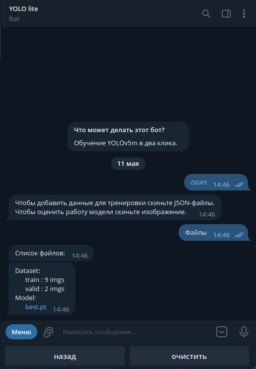

# Yolov5 telegram bot lite





# Install instruction
## 1. Install the Telegram-YOLO
```
git clone https://github.com/BelotserkovskiyVA/bot_lite.git
cd bot_lite/
pip install -r requirements.txt
```
you may need to install the libopencv-imgcodecs3.2 library
```
sudo apt update
sudo apt install libopencv-imgcodecs3.2
```
## 2. Set a BOT_TOKEN into config.py

```
BOT_TOKEN = '12345:abcde' #Your_token
```
## 3. Install ultralytics/yolov5
```
git clone --depth 1 --branch v6.0 https://github.com/ultralytics/yolov5.git
#git clone https://github.com/ultralytics/yolov5.git
```
## 4. Make changes to programs:  
```
cp yolov5m_leaky.pt yolov5/yolov5m_leaky.pt
```
export_insertion.py -> export.py;
yolo_insertion.py -> yolo.py;
## 5. Start bot
```
python3 main.py
```

